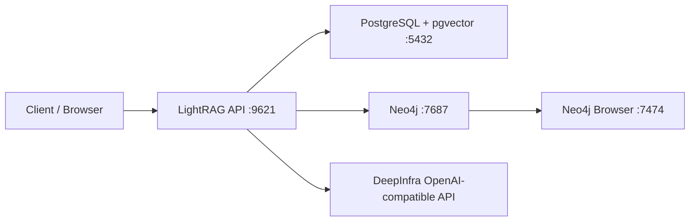

# LightRAG Stack (Docker Compose)

Local stack for running [LightRAG](https://github.com/HKUDS/LightRAG) with dedicated storage backends:
- `PostgreSQL` with `pgvector` (metadata, KV, document status, and vector index)
- `Neo4j` (graph)
- DeepInfra LLM via `Qwen/Qwen3-14B`
- DeepInfra embeddings via `BAAI/bge-m3`

## Architecture



## Quick Start

1. Create a DeepInfra API token.
2. Prepare environment variables:
   ```bash
   cp .env.example .env
   ```
3. Fill in secrets in `.env`:
   - `LLM_BINDING_API_KEY` - DeepInfra token
   - `EMBEDDING_BINDING_API_KEY` - same DeepInfra token
   - `POSTGRES_PASSWORD`
   - `NEO4J_PASSWORD` (must match `NEO4J_AUTH` in `docker-compose.yml`)
4. If you are changing from another embedding model or dimension, reset old data first:
   ```bash
   ./scripts/reset-local-storage.sh
   ```
5. Start services:
   ```bash
   docker compose up -d
   ```
6. Verify everything is running:
   ```bash
   docker compose ps
   ```

## Endpoints

- LightRAG API: `http://localhost:9621`
- DeepInfra OpenAI-compatible API: `https://api.deepinfra.com/v1/openai`
- Neo4j Browser: `http://localhost:7474`
- PostgreSQL: `localhost:5432`

## LLM With DeepInfra

The project is configured for Qwen3-14B through DeepInfra:

```env
LLM_BINDING=openai
LLM_MODEL=Qwen/Qwen3-14B
LLM_BINDING_HOST=https://api.deepinfra.com/v1/openai
LLM_BINDING_API_KEY=YOUR_DEEPINFRA_TOKEN_HERE
```

DeepInfra's OpenAI-compatible chat completions endpoint is `https://api.deepinfra.com/v1/openai/chat/completions`, so LightRAG uses the base URL without `/chat/completions`.

## Embeddings With DeepInfra

The project is configured for `BAAI/bge-m3` through DeepInfra:

```env
EMBEDDING_BINDING=openai
EMBEDDING_MODEL=BAAI/bge-m3
EMBEDDING_DIM=1024
EMBEDDING_TOKEN_LIMIT=8192
EMBEDDING_BINDING_HOST=https://api.deepinfra.com/v1/openai
EMBEDDING_BINDING_API_KEY=YOUR_DEEPINFRA_TOKEN_HERE
EMBEDDING_SEND_DIM=false
```

BGE-M3 uses 1024-dimensional embeddings. Existing vectors created with another dimension, such as OpenAI `text-embedding-3-small` at 1536 dimensions or Gemini embeddings, are incompatible with the new PostgreSQL vector schema. Run `./scripts/reset-local-storage.sh` before reindexing documents.

## Data Layout

```text
data/
├── lightrag/
│   ├── inputs/        # source documents for indexing
│   └── rag_storage/   # LightRAG working files
├── neo4j/             # Neo4j data
└── postgres/          # PostgreSQL + pgvector data
```

## Useful Commands

Start:
```bash
docker compose up -d
```

LightRAG logs:
```bash
docker compose logs -f lightrag
```

Restart one service:
```bash
docker compose restart lightrag
```

Stop:
```bash
docker compose down
```

Stop and remove volumes (warning: deletes data):
```bash
docker compose down -v
```

Reset local LightRAG records after changing embedding model/dimension:
```bash
./scripts/reset-local-storage.sh
```

## Configuration

Main variables in `.env`:
- `HOST`, `PORT` - LightRAG host and port
- `INPUT_DIR`, `WORKING_DIR` - paths inside the LightRAG container
- `LLM_*` - generation model and endpoint settings
- `EMBEDDING_*` - embedding model and endpoint settings
- `LIGHTRAG_*_STORAGE` - storage backend selection
- `POSTGRES_*`, `NEO4J_*` - external service connection settings

This stack uses `PGVectorStorage` for vectors. Switching from another vector backend, such as Qdrant, requires a clean reindex; LightRAG does not migrate vector data between storage implementations.

## Container Image Versions

Container images are pinned to explicit version tags in `docker-compose.yml`:
- `ghcr.io/hkuds/lightrag:v1.4.16`
- `pgvector/pgvector:0.8.2-pg16`
- `neo4j:2026.01.4`

To upgrade intentionally, replace these tags after testing the new images.

## Security

- Do not commit `.env` to the repository.
- Replace all `change_me_*` passwords with strong values.
- If secrets were ever committed, rotate API keys immediately.

## Common Issues

`LightRAG does not start due to database readiness`:
- Wait 10-20 seconds, then check logs:
  ```bash
  docker compose logs --tail=200 postgres neo4j lightrag
  ```

`Neo4j authentication error`:
- Verify `NEO4J_PASSWORD` in `.env` matches `NEO4J_AUTH` in `docker-compose.yml`.

`No responses from LLM/Embeddings`:
- Verify API keys and endpoint availability for `LLM_BINDING_HOST` and `EMBEDDING_BINDING_HOST`.
- Verify both API key variables contain a valid DeepInfra token.
- From the host, check the chat endpoint:
  ```bash
  curl https://api.deepinfra.com/v1/openai/chat/completions \
    -H "Content-Type: application/json" \
    -H "Authorization: Bearer $DEEPINFRA_TOKEN" \
    -d '{"model":"Qwen/Qwen3-14B","messages":[{"role":"user","content":"Hello"}]}'
  ```

## License

See the official repositories for licenses of used container images and the LightRAG project.
